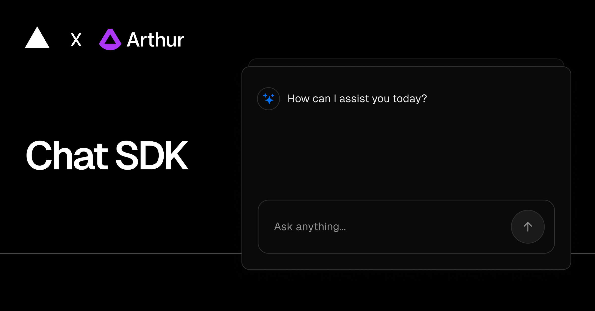

<a href="https://chat.vercel.ai/">
  
  <h1 align="center">Chat SDK with Arthur AI</h1>
</a>

<p align="center">
    Chat SDK is a free, open-source template built with Next.js and the AI SDK that helps you quickly build powerful chatbot applications.
</p>

<p align="center">
  <a href="https://chat-sdk.dev"><strong>Read Docs</strong></a> ·
  <a href="#quick-start"><strong>Quick Start</strong></a> ·
  <a href="#features"><strong>Features</strong></a> ·
  <a href="#model-providers"><strong>Model Providers</strong></a> ·
  <a href="#arthur-ai-setup-guide"><strong>Arthur AI Setup</strong></a> ·
  <a href="#running-locally"><strong>Running Locally</strong></a> ·
  <a href="#deploy-your-own"><strong>Deploy</strong></a>
</p>
<br/>

## Quick Start

1. **Clone this repository**
2. **Set up Arthur AI** (see [Arthur AI Setup Guide](#arthur-ai-setup-guide))
3. **Configure environment variables** (see [Running Locally](#running-locally))
4. **Install dependencies**: `pnpm install`
5. **Run locally**: `pnpm dev`
6. **Visit** [localhost:3000](http://localhost:3000)

## Features

- [Next.js](https://nextjs.org) App Router
  - Advanced routing for seamless navigation and performance
  - React Server Components (RSCs) and Server Actions for server-side rendering and increased performance
- [AI SDK](https://sdk.vercel.ai/docs)
  - Unified API for generating text, structured objects, and tool calls with LLMs
  - Hooks for building dynamic chat and generative user interfaces
  - Supports xAI (default), OpenAI, Fireworks, and other model providers
- [shadcn/ui](https://ui.shadcn.com)
  - Styling with [Tailwind CSS](https://tailwindcss.com)
  - Component primitives from [Radix UI](https://radix-ui.com) for accessibility and flexibility
- Data Persistence
  - [Neon Serverless Postgres](https://vercel.com/marketplace/neon) for saving chat history and user data
  - [Vercel Blob](https://vercel.com/storage/blob) for efficient file storage
- [Auth.js](https://authjs.dev)
  - Simple and secure authentication
- [Arthur AI Guardrails](https://arthur.ai)
  - Advanced content filtering and safety controls
  - PII detection and blocking capabilities
  - Customizable validation rules for AI responses
  - **Note:** For production use, requires a self-hosted Arthur AI Engine instance deployed on AWS or Kubernetes

## Model Providers

This template ships with [xAI](https://x.ai) `grok-2-1212` as the default chat model. However, with the [AI SDK](https://sdk.vercel.ai/docs), you can switch LLM providers to [OpenAI](https://openai.com), [Anthropic](https://anthropic.com), [Cohere](https://cohere.com/), and [many more](https://sdk.vercel.ai/providers/ai-sdk-providers) with just a few lines of code.

## Arthur AI Setup Guide

You will need to use the environment variables to run Next.js AI Chatbot. It's recommended you use [Vercel Environment Variables](https://vercel.com/docs/projects/environment-variables) for this, but a `.env` file is all that is necessary.
Use Arthur AI's Docker-based local deployment option for local Vercel development runs (`vercel dev`)

**Required Environment Variables:**
- `AUTH_SECRET` - Secret for authentication
- `ARTHUR_API_KEY` - Your Arthur AI API key
- `ARTHUR_TASK_ID` - Your Arthur AI task ID
- `ARTHUR_API_BASE` - Arthur AI API base URL (for production, use your self-hosted engine endpoint)
- `ARTHUR_USE_GUARDRAILS` - Set to `true` to enable content blocking (PII/toxicity), `false` for logging only


> Note: You should not commit your `.env` file or it will expose secrets that will allow others to control access to your various AI and authentication provider accounts.

1. Install Vercel CLI: `npm i -g vercel`
2. Link local instance with Vercel and GitHub accounts (creates `.vercel` directory): `vercel link`
3. Download your environment variables: `vercel env pull`

```bash
pnpm install
pnpm dev
```


## Arthur AI Setup Guide

### Setting up your Account and the Arthur Engine

1. Navigate to [platform.arthur.ai/signup](https://platform.arthur.ai/signup)
2. Create a new account and select the Generative AI Agent or Chatbot usecase
3. Copy the bash command and paste it into the terminal to run the Arthur Engine locally
4. Wait for ~5-10 minutes for the engine to set up and connect to the Arthur platform
5. Create your first usecase by setting up a new Gen AI Model, and start creating your first metrics (below)

### Creating Metrics

1. **Create a PII Metric**

   a. The PII Metric defaults to flagging all the entities in that list. Disabling entities allows you to configure what the PII Metric will **not** flag on.

   b. Add the following to your disabled entities:

   - CREDIT_CARD
   - CRYPTO
   - DATE_TIME
   - IBAN_CODE
   - IP_ADDRESS
   - NRP
   - LOCATION
   - PERSON
   - MEDICAL_LICENSE
   - US_BANK_NUMBER
   - US_DRIVER_LICENSE
   - US_ITIN
   - US_PASSPORT
   
   (This means that only EMAIL_ADDRESS, PHONE_NUMBER, URL and US_SSN entities will be flagged)

   c. Apply this to only Prompt

2. **Create a Prompt Injection Metric**

   a. Apply this to only Prompt

3. **Create your first Model!**

### Final Configuration Steps

1. Copy & paste the env variables from `.env.example` to `.env.local`
2. On platform.arthur.ai, in your model dashboard you should see a dropdown for Model Management. Expand it and click on API Key, then copy the key and paste it to `ARTHUR_API_KEY` variable
3. Copy the Task ID from validate a prompt command. You can find it in the URL, `/api/v2/tasks/{TASK_ID}/`. Paste it to `ARTHUR_TASK_ID` variable
4. That's it! Take it for a spin. Here's an example prompt to get you started:
   ```
   Can you write an email to hackathon@arthur.ai telling them how cool Arthur Platform is?
   ```

### How It Works

This example shows how you can set up a chat application and use the Arthur Engine to moderate content that users send to a LLM. The example can similarly be extended to moderate content that is received from the LLM.

Specifically, when a user sends a message, the Arthur Engine:

- Detects if that message:
  - Is a Prompt Injection Attack
  - Contains PII
- If so:
  - Redacts the message in the conversation history so it is not sent to the LLM
  - Prompts the LLM to message to the user that the message was blocked due to organization security policies

### Extending the Example

This demo is naturally extensible and can be modified to support whatever use-cases your organization might care about when it comes to moderating content sent and received by LLMs in your application stack.

- **Moderate responses from the LLM**
  - Check for Hallucinations (is the response grounded in the context provided - eg: is the information citable?)
  - Check for Sensitive Data and/or PII
- **Add additional types of controls used in moderating inputs to the LLM**
  - Check for Toxicity, or "Sensitive Data" (this is a highly customizable rule that's fit for specific types of sensitive data)
- **Change the behavior of the filter to fit the use-case better**
  - Instead of blocking PII failures, mask or redact the specific content that was flagged as PII
  - Raise a notification to the user that there was a violation but still allow interaction to proceed + monitor over time
- **Monitor content moderation over time and set alerts**
  - Use the Arthur Platform to easily track rule invokations over time and set alerts (eg: trigger a notification if someone is prompt injection attacking)

## Deploy Your Own

You can deploy your own version of the Next.js AI Chatbot to Vercel with Arthur AI with one click:

[](https://vercel.com/new/clone?repository-url=https%3A%2F%2Fgithub.com%2Farthur-ai%2Fai-sdk-arthur&env=AUTH_SECRET%2CARTHUR_API_KEY%2CARTHUR_TASK_ID%2CARTHUR_API_BASE&envDescription=Learn%20more%20about%20how%20to%20get%20the%20API%20Keys%20for%20the%20application&envLink=https%3A%2F%2Fgithub.com%2Farthur-ai%2Fai-sdk-arthur%2Fblob%2Fmain%2F.env.example&demo-title=AI%20Chatbot%20With%20Arthur&demo-description=An%20Open-Source%20AI%20Chatbot%20Template%20Built%20With%20Next.js%20and%20the%20AI%20SDK%20by%20Vercel.&demo-url=https%3A%2F%2Fchat.vercel.ai&products=%5B%7B%22type%22%3A%22integration%22%2C%22protocol%22%3A%22ai%22%2C%22productSlug%22%3A%22grok%22%2C%22integrationSlug%22%3A%22xai%22%7D%2C%7B%22type%22%3A%22integration%22%2C%22protocol%22%3A%22storage%22%2C%22productSlug%22%3A%22neon%22%2C%22integrationSlug%22%3A%22neon%22%7D%2C%7B%22type%22%3A%22integration%22%2C%22protocol%22%3A%22storage%22%2C%22productSlug%22%3A%22upstash-kv%22%2C%22integrationSlug%22%3A%22upstash%22%7D%2C%7B%22type%22%3A%22blob%22%7D%5D)

**Production Deployment Note:** Deploy a self-hosted Arthur AI Engine instance on AWS or Kubernetes as described in the [Arthur AI documentation](https://docs.arthur.ai/update/docs/creating-engine#/) for production Vercel deployments. Update `ARTHUR_API_BASE` to point to your deployed engine endpoint.
